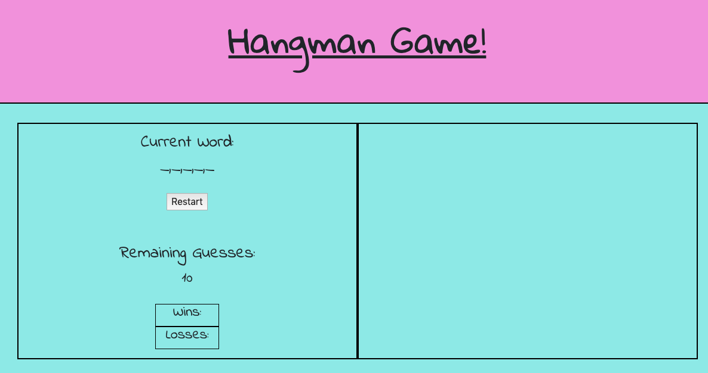
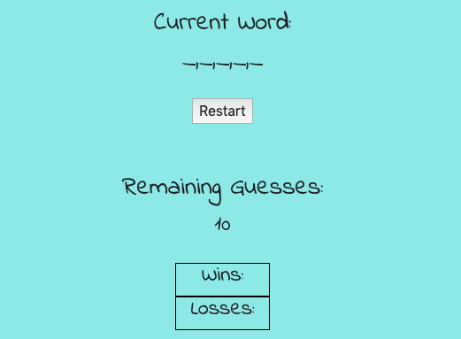
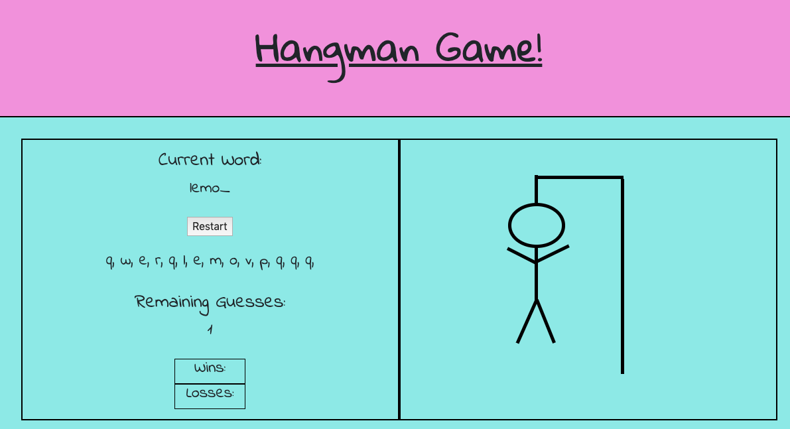

# Hangman
A simple version of the popular Hangman game. Type letters to reveal the mistery words! 

Technologies used: HTML5, CSS3, JavaScript, jQuery, Bootstrap.

When the player opens the game, this opening screen appears:

The left side displays the game status.

The player needs to guess letters. If the guess matches a letter in the mistery word, the underscore will reveal the place of the correctly guessed letter. At the same time the guessed letter will appear below too, so the player will be able to keep track of all the letters he guessed. 

If there is an incorrect guess, the Hangman tree starts to built. All together the player has 10 chances to miss. If he is successful, he wins, if not, the tree will finish up building with the stickman figure hanging on it, and the game ends. 

Here is the deployed link to the game. 

https://szilard-molnar.github.io/word_guessing_name/

Hope you will enjoy!
